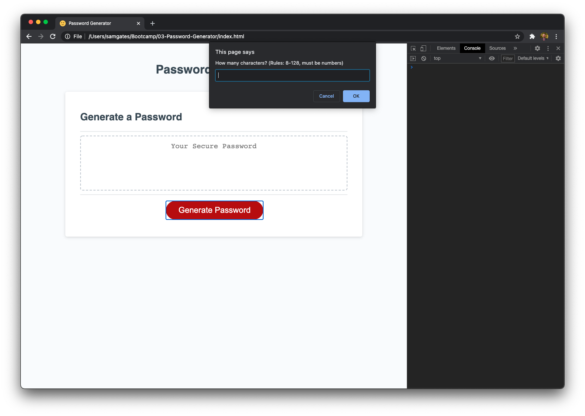
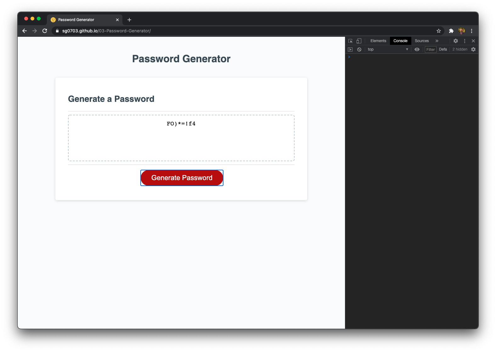

# Password Generator - Due 2/22/21

## Description

For this homework assignment, I was tasked with modifying starter code and adding significantly to it in order to create a random password generator. The objectives are listed below (copied from original):

```
GIVEN I need a new, secure password
WHEN I click the button to generate a password
THEN I am presented with a series of prompts for password criteria
WHEN prompted for password criteria
THEN I select which criteria to include in the password
WHEN prompted for the length of the password
THEN I choose a length of at least 8 characters and no more than 128 characters
WHEN prompted for character types to include in the password
THEN I choose lowercase, uppercase, numeric, and/or special characters
WHEN I answer each prompt
THEN my input should be validated and at least one character type should be selected
WHEN all prompts are answered
THEN a password is generated that matches the selected criteria
WHEN the password is generated
THEN the password is either displayed in an alert or written to the page
```

## Actions taken

1. Added a FAVICON link to the HTML to resolve a Google Chrome error in the console
2. Wrote a function to properly gather user input for character length
3. Wrote a function to properly gather user input for each selection type (yes/no format)
4. Wrote a function to take the valid user input and use it to generate password
5. Password generator function also verifies that each selection made by user is present in final password generated
6. Wrote supporting functions, such as getRandomValue() and getCharOptions() that support other functions but improve readability and efficiency of the code
7. Left comments throughout script.js describing functionality
8. Organized order of code so that functions are readable in order they are called
9. Utilized GitHub to track changes and make the page go live 
10. Created a quality README describing the project
11. Created subfolders (css, js, images) for resources to properly organize them


## Link to deployed project

See the deployed project by following this link: https://sg0703.github.io/03-Password-Generator/
See the code repository here: https://github.com/sg0703/03-Password-Generator

## Screenshots


